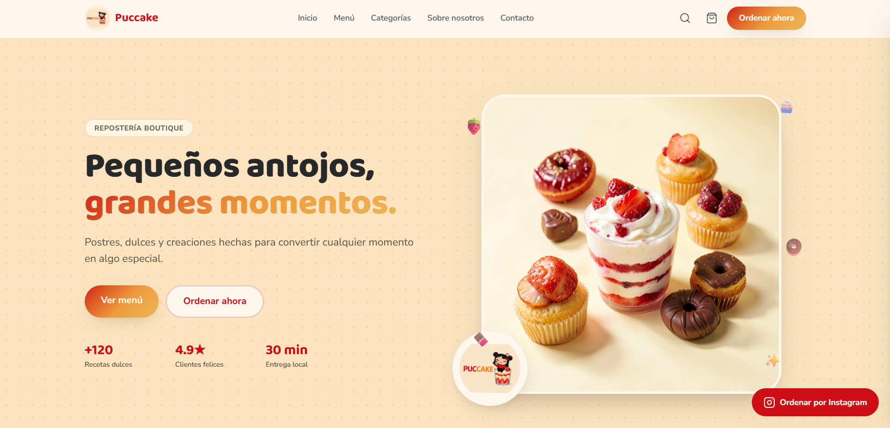

<h1 align="center">
  
</h1>

<p align="center">
  <b>Software Developer • IA • Backend • Automatización</b>
</p>

<p align="center">
  🇩🇴 República Dominicana
</p>

<p align="center">
  <a href="https://github.com/benjamin23k">
    
  </a>
</p>

<p align="center">
  <a href="https://github.com/benjamin23k">
    
  </a>
</p>

---

## 🐈‍⬛ Sobre mí


Soy **Wilson Benjamin**, estudiante de **Desarrollo de Software** 🇩🇴.

Me gusta construir proyectos donde la programación se mezcla con la creatividad: bots, inteligencia artificial, videojuegos, automatización y aplicaciones que resuelven problemas reales.

- 💻 Desarrollo principalmente con **C#, Python y TypeScript**
- 🤖 Explorando **Inteligencia Artificial y automatización**
- ⚙️ Interesado en **Backend, arquitectura de software y APIs**
- 🎮 Me gusta convertir ideas de videojuegos en proyectos reales
- 🎨 También disfruto el **pixel art y el diseño digital**
- 🐧 Usuario de Linux
- 🎸 Aprendiendo guitarra
- 🌙 Probablemente programando cuando debería estar durmiendo

<br clear="right"/>

---

# 🐾 Proyectos destacados

<table>
<tr>
<td width="50%" valign="top">

<h3 align="center">👁️ El Testigo</h3>

<p align="center">
  <a href="https://github.com/benjamin23k/ResumeBot">
    
</p>

Bot inteligente para WhatsApp que observa la actividad de grupos, almacena mensajes y genera resúmenes contextuales usando IA.

### Características

- 💬 Integración con WhatsApp
- 🧠 Resúmenes mediante IA
- 🗃️ Historial de mensajes
- ✏️ Seguimiento de mensajes editados
- 🎙️ Resúmenes por voz
- ⏰ Resúmenes automáticos
- 🧾 Persistencia con SQLite

<p align="center">
  
</p>

<p align="center">
  <a href="https://github.com/benjamin23k/ResumeBot">
    
  </a>
</p>

</td>

<td width="50%" valign="top">

<h3 align="center">🧁 Puccake</h3>

<p align="center">
  <a href="https://github.com/benjamin23k/puccake-sweet-spot">
   
</p>

Una página web moderna para una marca de repostería, enfocada en identidad visual, productos y experiencia de usuario.

### Características

- 🧁 Catálogo de productos
- 🎨 Identidad visual personalizada
- 📱 Diseño responsive
- 🛍️ Presentación de productos
- ✨ Interfaz moderna

<p align="center">
  
</p>

<p align="center">
  <a href="https://github.com/benjamin23k/puccake-sweet-spot">
    
  </a>
</p>

</td>
</tr>
</table>

<p align="center">
  <a href="https://github.com/benjamin23k?tab=repositories">
    
  </a>
</p>

---

# 🎥 YouTube

<p align="center">
  <b>Programación • Proyectos • Experimentos • Aprendizaje</b>
</p>

<p align="center">
  <a href="https://www.youtube.com/@itsbenjamindev">
    
  </a>
</p>

<p align="center">
Comparto mi proceso aprendiendo programación, construyendo proyectos y experimentando con nuevas tecnologías.
</p>

---

# 🤝 Conecta conmigo

<p align="center">

  <a href="https://www.linkedin.com/in/benjamin-stack-12a079369/">
    
  </a>

  <a href="https://x.com/WilsonBenja2">
    
  </a>

  <a href="https://www.instagram.com/bxbyy.ben/">
    
  </a>

  <a href="TU_CANAL_YOUTUBE">
    
  </a>

  <a href="https://github.com/benjamin23k">
    
  </a>

</p>

---

# 💻 Tecnologías

## Lenguajes

<p align="left">
  
</p>

---

## Frameworks y tecnologías

<p align="left">
  
</p>

---

## Bases de datos

<p align="left">
  
</p>

---

## Herramientas

<p align="left">
  
</p>

---

# 📚 Actualmente aprendiendo

<p align="left">
  
</p>

```txt
Backend Development
Artificial Intelligence
Software Architecture
APIs
Full Stack Development
Automation
Cybersecurity
